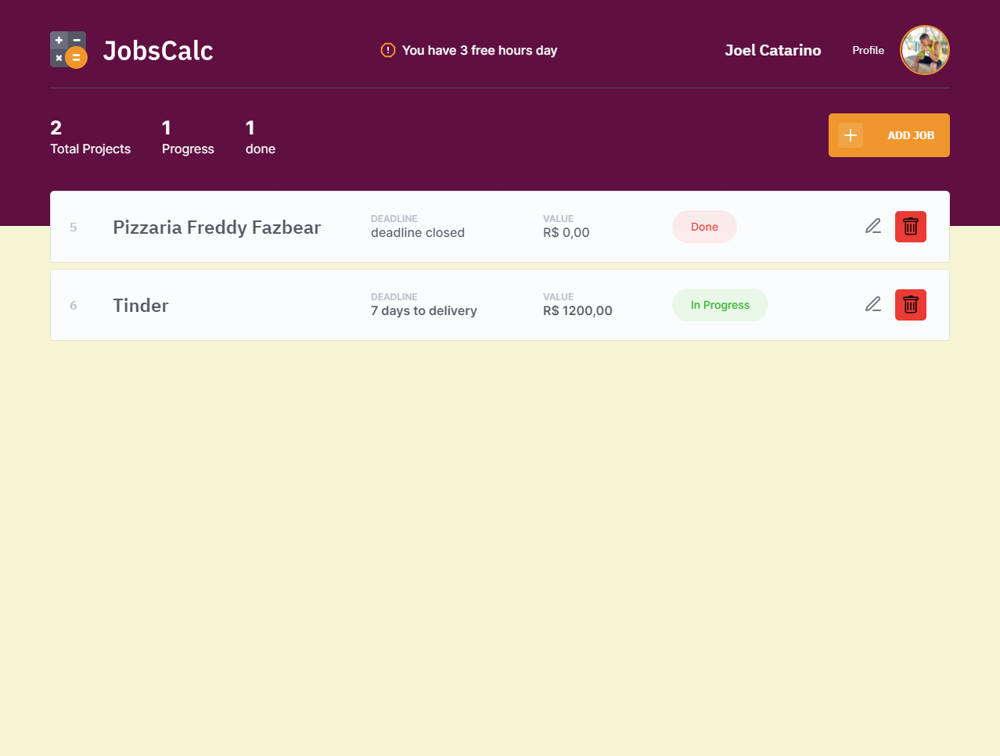

<h1 align="center">
  
</h1>

 

  

 

  
  

## 🚀 Tec

- HTML
- CSS
- JavaScript
- NodeJS
- EJS
- Express
- SQLite

## 💻 About

JobsCalc is a calculation estimation application for freelance projects, where it is possible to register and exclude jobs (projects), obtaining a cost estimate for each job. In addition, it is possible to plot the hourly value of the person who will be using the system 💰

## 🔖 Layout

You can view the project layout through [desse link](https://www.figma.com/file/s4fytPFbDiSkv4GPSfKaLE/Jobs-Planning). É necessário ter conta no [Figma](https://figma.com) to access it.

## :memo: License

This project is under license MIT. See the file [LICENSE](.github/LICENSE.md) para mais detalhes.

---

Feito com ♥ by Rocketseat :wave: [Participe da nossa comunidade!](https://discordapp.com/invite/gCRAFhc)
